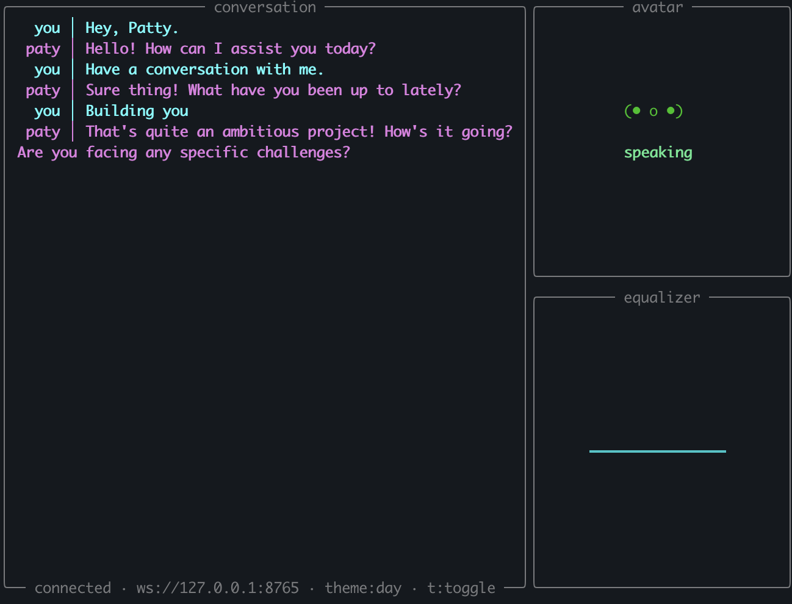
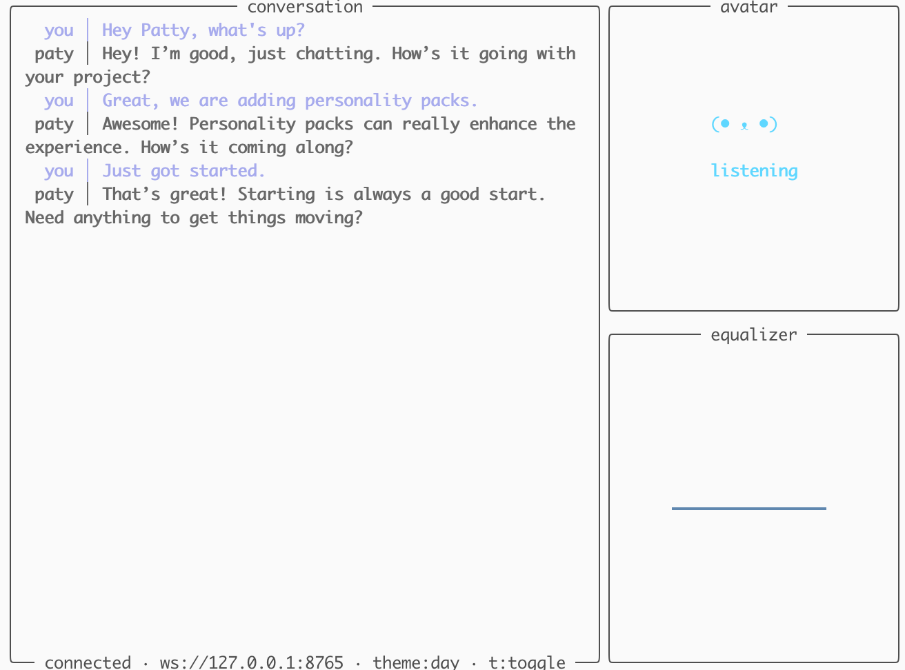

```text
┌─────────┐   ██████   █████   ██████   ██  ██
│    •  • │   █    █   █   █     ██     ██████
│      v  │   ██████   █████     ██       ██
└─────────┘   █        █   █     ██       ██
```
PATY is entirely local. And therefore, is entirely free.

# Install

Prerequisites: **Python 3.11+** and **[uv](https://docs.astral.sh/uv/)**.

```bash
curl -LsSf https://astral.sh/uv/install.sh | sh        # if you don't have uv
git clone https://github.com/PATYai/PATY.git
cd PATY/cli
```

Sync dependencies with the extra that matches your hardware:

```bash
uv sync --extra mlx     # Apple Silicon (M-series Macs)
uv sync --extra cuda    # NVIDIA GPU
uv sync --extra cpu     # CPU-only
```

# Run it

```bash
uv run paty run examples/paty.yaml
```

First launch downloads the LLM and STT models (a few GB) and is slow; subsequent runs reuse the Hugging Face cache.

CUDA/CPU users also need a [Kokoro FastAPI](https://github.com/remsky/Kokoro-FastAPI) server on `localhost:8880` for TTS — Apple Silicon runs Kokoro in-process.

See [`cli/README.md`](cli/README.md) for config schema, CLI commands, hardware profiles, and the event bus.

# Themes



## License

This project is licensed under the MIT License - see the [LICENSE](LICENSE) file for details.
